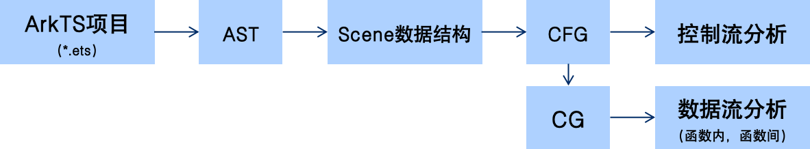
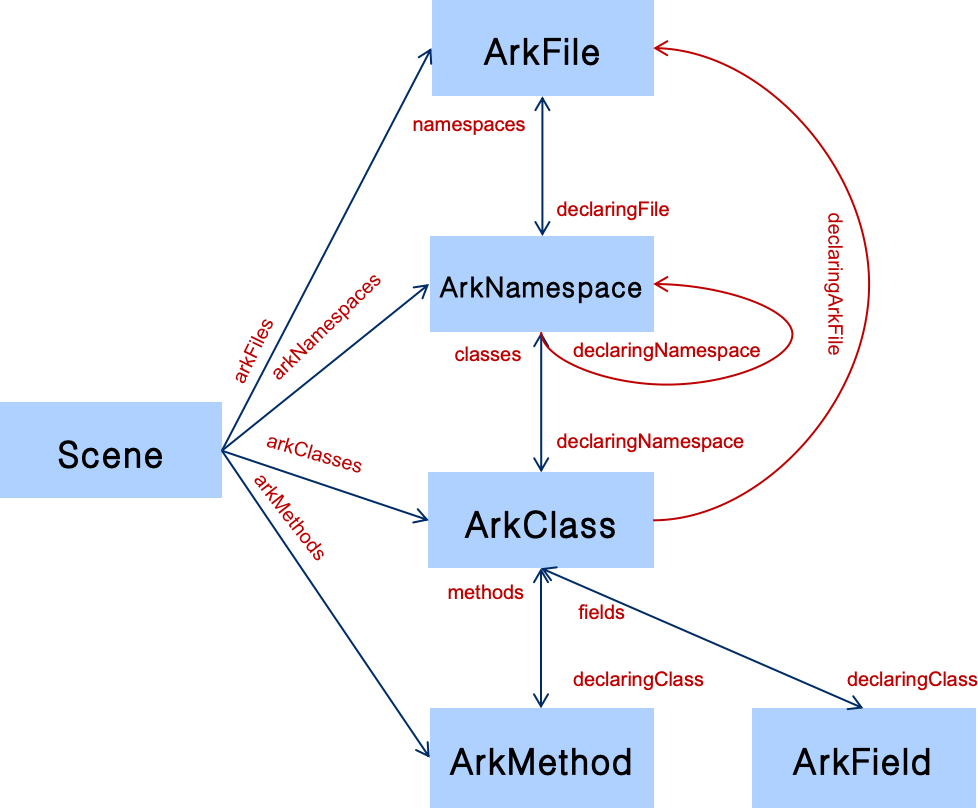

# ArkAnalyzer 快速入门指南

[TOC]

## 1 ArkAnalyzer 简介

ArkAnalyzer 是针对基于 ArkTS 语言开发的鸿蒙原生应用的静态代码分析框架。下图展示了其基本工作原理。目前，ArkAnalyzer 的输入为 ArkTS 文件（即后缀为 ets 的文件）。ArkAnalyzer 会先为 ArkTS代码生成一个抽象语法树（AST），接着遍历这颗语法树并生成一个 Scene数据结构。这个 Scene 数据结构对代码结构进行了抽象，用户可通过该数据结构快速获取 ArkTS 项目中某个具体的类、函数或者属性。接下来，ArkAnalyzer 为每一个函数生成一个控制流程图（CFG），用户可基于此图进行控制流相关的分析。基于 CFG，ArkAnalyzer 进一步实现方法调用图的生成（CG），并基于此支持用户实现数据流分析。



### 1.1 Scene 数据结构

Scene 是 ArkAnalyzer 的核心数据结构，它是对整个项目的抽象表示。Scene 包含了项目中所有的文件、类、方法、命名空间等信息，是进行静态分析的基础。


**Scene 的主要作用**：

- **项目结构抽象**：将整个项目的代码结构组织成层次化的数据结构
- **全局上下文管理**：提供项目全局上下文，支持跨文件引用解析
- **统一访问接口**：通过 Scene 可以快速访问项目中的任意文件、类、方法等


**详细说明**：关于 Scene 的详细结构和使用方法，请参考 [IR详细文档 - Scene类](./IRArchitectureAnalysis.md#11-scene类---项目级抽象)

### 1.2 IR（中间表示）简介

ArkAnalyzer 使用三地址码（3AC）形式的IR，主要特点：

- **临时变量命名**：采用 `%0`, `%1`, `%2`, ... 的形式（前缀为 `%`，后跟数字序号）
- **匿名函数命名**：匿名函数会被显式命名，格式为 `%AM0`, `%AM1`, `%AM2`, ...（`%AM` 前缀 + 数字序号）
- **匿名类命名**：匿名类会被显式命名，格式为 `%AC0`, `%AC1`, `%AC2`, ...（`%AC` 前缀 + 数字序号）
- **循环转换**：所有循环（while, for, for-of, for-in）转换为基本块配合 if 语句的形式
- **语法糖处理**：匿名函数、forEach 等语法糖会被显式展开

**详细说明**：请参考 [IR详细文档](./IR.md#二ir转换过程详解) 和 [Stmt/Expr参考文档](./StmtExprReference.md)

## 2. 环境配置

### 2.1 前置要求

1. **Node.js**: 从 [Node.js官网](https://nodejs.org/en/download/current) 下载并安装（推荐使用最新LTS版本）
2. **TypeScript**: 通过npm全局安装
   ```shell
   npm install -g typescript
   ```
3. **IDE**: 推荐使用 [Visual Studio Code](https://code.visualstudio.com/download)

### 2.2 安装依赖

```shell
# 克隆项目后，进入项目目录，安装依赖
npm install
```

### 2.3 构建项目

```shell
# 编译TypeScript代码
npm run build
```

### 2.4 生成API文档（可选）

```shell
# 生成API文档到 docs/api_docs
npm run gendoc
```

### 2.5 运行第一个用例

完成环境配置后，可以运行 `tests/samples` 目录下的测试用例来快速体验ArkAnalyzer的功能。

**示例：运行控制流图分析测试**

```shell
# 用npx命令运行CfgTest（控制流图分析测试）
npx ts-node tests/samples/CfgTest.ts

# 或者用node命令
node -r ts-node/register tests/samples/CfgTest.ts
```

这个测试用例会：
1. 构建一个示例项目的Scene
2. 执行类型推断
3. 遍历所有方法，打印每个方法的控制流图（基本块和语句）
4. 显示基本块之间的控制流关系

**测试用例说明**：

```typescript
// tests/samples/CfgTest.ts 的核心代码
import { SceneConfig, Scene, DEFAULT_ARK_METHOD_NAME, Logger, LOG_LEVEL, LOG_MODULE_TYPE } from '../../src';

const logger = Logger.getLogger(LOG_MODULE_TYPE.TOOL, 'CfgTest');
Logger.configure('', LOG_LEVEL.ERROR, LOG_LEVEL.INFO, false);

// 1. 构建Scene
const config = new SceneConfig();
config.buildFromProjectDir("tests/resources/cfg/classMap");
const scene = new Scene();
scene.buildSceneFromProjectDir(config);
scene.inferTypes();

// 2. 遍历所有方法并分析CFG
for (const arkFile of scene.getFiles()) {
    for (const arkClass of arkFile.getClasses()) {
        for (const arkMethod of arkClass.getMethods()) {
            if (arkMethod.getName() == DEFAULT_ARK_METHOD_NAME) {
                continue;  // 跳过默认方法
            }
            
            const body = arkMethod.getBody();
            const blocks = [...body!.getCfg().getBlocks()];
            
            // 打印每个基本块及其语句
            for (let i = 0; i < blocks.length; i++) {
                const block = blocks[i];
                logger.info("block" + i);
                for (const stmt of block.getStmts()) {
                    logger.info("  " + stmt.toString());
                }
                
                // 打印控制流边
                let text = "next:";
                for (const next of block.getSuccessors()) {
                    text += blocks.indexOf(next) + ' ';
                }
                logger.info(text);
            }
        }
    }
}
```

**其他部分可运行的测试用例**：

- `DefUseChainTest.ts` - 定义-使用链分析
- `TypeInferenceTest.ts` - 类型推断测试
- `SceneTest.ts` - Scene构建和遍历
- `CallGraphTest.ts` - 调用图构建

更多测试用例请查看 `tests/samples/` 目录。

## 3. ArkAnalyzer使用样例

### 3.1 基本功能 - 构建Scene（ex01）

#### 步骤1：创建配置
ArkAnalyzer的分析对象支持指定目录（适合简单测试）或指定鸿蒙应用工程。如果指定鸿蒙工程，ArkAnalyzer会额外读取工程配置信息，这里需要首先构建如下的JSON指定工程目录和SDK目录信息：

**配置文件示例** (`config.json`):
```json
{
  "targetProjectName": "MyProject",
  "targetProjectDirectory": "path/to/project",
  "sdks": [
    {
      "name": "etsSdk",
      "path": "path/to/sdk",
      "moduleName": ""
    }
  ],
  "options": {
    "supportFileExts": [".ets", ".ts"],
    "enableBuiltIn": true
  }
}
```

#### 步骤2：构建Scene

```typescript
import { SceneConfig, Scene } from 'src/index';//index.ts的相对目录

// 方式1：从项目目录构建配置
const config = new SceneConfig();
config.buildFromProjectDir('path/to/your/project');

// 方式2：从JSON文件构建配置
const config = new SceneConfig();
config.buildFromJson('path/to/config.json');

// 创建Scene对象
const scene = new Scene();

// 方式1：从项目目录构建（适用于简单项目）
scene.buildSceneFromProjectDir(config);

// 方式2：构建OpenHarmony项目（支持模块化）
scene.buildBasicInfo(config);
scene.buildScene4HarmonyProject();
```

#### 步骤3：执行类型推断

```typescript
// 执行全局类型推断（推荐在分析前执行）
scene.inferTypes();
```

### 3.2 基本示例：遍历项目结构（ex02）

```typescript
import { Scene, SceneConfig, DEFAULT_ARK_CLASS_NAME, DEFAULT_ARK_METHOD_NAME } from 'src/index';

// 构建Scene
const config = new SceneConfig();
config.buildFromProjectDir('tests/resources/example');
const scene = new Scene();
scene.buildSceneFromProjectDir(config);
scene.inferTypes();

// 遍历所有文件
for (const arkFile of scene.getFiles()) {
    console.log(`文件: ${arkFile.getName()}`);
    
    // 遍历文件中的所有类
    for (const arkClass of arkFile.getClasses()) {
        // 跳过默认类（可选）
        if (arkClass.getName() === DEFAULT_ARK_CLASS_NAME) {
            continue;
        }
        
        console.log(`  类: ${arkClass.getName()}`);
        
        // 遍历类中的所有方法
        for (const arkMethod of arkClass.getMethods()) {
            // 跳过默认方法（可选）
            if (arkMethod.getName() === DEFAULT_ARK_METHOD_NAME) {
                continue;
            }
            
            console.log(`    方法: ${arkMethod.getName()}`);
            
            // 访问方法体
            const body = arkMethod.getBody();
            if (body) {
                // 获取局部变量
                body.getLocals().forEach(local => {
                    console.log(`      局部变量: ${local.getName()}, 类型: ${local.getType()}`);
                });
            }
        }
    }
}
```

**详细说明**：更多遍历和分析示例请参考 [IR文档 - 使用IR进行静态分析的实际示例](./IR.md#六使用ir进行静态分析的实际示例)

### 3.3 控制流图（CFG）分析（ex03）
通过 ArkMethod 的getBody()方法获取方法体，再通过getCfg()方法可以获取方法的CFG，示例如下所示。
```typescript
import { Scene, SceneConfig, DEFAULT_ARK_METHOD_NAME } from 'src/index';

const scene = new Scene();
// ... 构建scene ...

for (const method of scene.getMethods()) {
    if (method.getName() === DEFAULT_ARK_METHOD_NAME) {
        continue;
    }
    
    const body = method.getBody();
    if (!body) continue;
    
    const cfg = body.getCfg();
    const blocks = [...cfg.getBlocks()];
    
    // 遍历所有基本块
    for (let i = 0; i < blocks.length; i++) {
        const block = blocks[i];
        console.log(`基本块 ${i}:`);
        
        // 打印基本块中的语句
        for (const stmt of block.getStmts()) {
            console.log(`  ${stmt.toString()}`);
        }
        
        // 打印控制流边
        const successors = block.getSuccessors();
        if (successors.length > 0) {
            const nextBlocks = successors.map(succ => blocks.indexOf(succ)).join(', ');
            console.log(`  后继: ${nextBlocks}`);
        }
    }
    
    // 检测不可达基本块
    const unreachable = cfg.getUnreachableBlocks();
    if (unreachable.size > 0) {
        console.warn(`发现 ${unreachable.size} 个不可达基本块`);
    }
}
```

**详细说明**：CFG的详细结构和使用方法请参考 [IR文档 - CFG层](./IR.md#1441-cfg---控制流图)

### 4.2 定义-使用链分析

```typescript
import { Scene, SceneConfig, DEFAULT_ARK_METHOD_NAME } from 'arkanalyzer';

const scene = new Scene();
// ... 构建scene和类型推断 ...

for (const method of scene.getMethods()) {
    if (method.getName() === DEFAULT_ARK_METHOD_NAME) {
        continue;
    }
    
    const cfg = method.getBody()!.getCfg();
    
    // 构建定义-使用链
    cfg.buildDefUseChain();
    
    // 遍历所有定义-使用链
    for (const chain of cfg.getDefUseChains()) {
        console.log(`变量: ${chain.value.toString()}`);
        console.log(`  定义: ${chain.def.toString()}`);
        console.log(`  使用: ${chain.use.toString()}`);
        
        // 获取源码位置
        const defPos = chain.def.getOriginPositionInfo();
        const usePos = chain.use.getOriginPositionInfo();
        console.log(`  定义位置: 行${defPos.getLineNo()}, 列${defPos.getColNo()}`);
        console.log(`  使用位置: 行${usePos.getLineNo()}, 列${usePos.getColNo()}`);
    }
}
```

**详细说明**：定义-使用链的详细说明请参考 [IR文档 - 定义-使用链分析](./IR.md#63-定义-使用链分析)

### 4.3 类型推断和分析

```typescript
import { Scene, SceneConfig, UnknownType } from 'arkanalyzer';

const scene = new Scene();
// ... 构建scene ...

// 执行类型推断
scene.inferTypes();

// 分析局部变量类型
for (const method of scene.getMethods()) {
    const body = method.getBody();
    if (!body) continue;
    
    body.getLocals().forEach(local => {
        const type = local.getType();
        console.log(`变量 ${local.getName()}: ${type.toString()}`);
        
        // 检测未知类型
        if (type instanceof UnknownType) {
            console.warn(`  警告: ${local.getName()} 的类型未知`);
        }
    });
}
```

**详细说明**：类型系统的详细说明请参考 [IR文档 - 类型推断和分析](./IR.md#64-类型推断和分析)

### 4.4 调用图构建

```typescript
import { Scene, SceneConfig, CallGraph, CallGraphBuilder, MethodSignature, DEFAULT_ARK_CLASS_NAME } from 'arkanalyzer';

const scene = new Scene();
// ... 构建scene和类型推断 ...

// 1. 确定入口点
const entryPoints: MethodSignature[] = [];

// 从main方法开始
for (const file of scene.getFiles()) {
    if (file.getName() === 'main.ts') {
        for (const cls of file.getClasses()) {
            if (cls.getName() === DEFAULT_ARK_CLASS_NAME) {
                for (const method of cls.getMethods()) {
                    if (method.getName() === 'main') {
                        entryPoints.push(method.getSignature());
                    }
                }
            }
        }
    }
}

// 2. 构建调用图
const callGraph = new CallGraph(scene);
const builder = new CallGraphBuilder(callGraph, scene);

// 使用类层次分析（CHA）构建调用图
builder.buildClassHierarchyCallGraph(entryPoints, false);

// 或者使用快速类型分析（RTA）
// builder.buildRapidTypeCallGraph(entryPoints, false);

// 3. 分析调用图
console.log(`调用图统计: ${callGraph.getStat()}`);
console.log(`入口点数量: ${callGraph.getEntries().length}`);

// 遍历调用图节点
for (const node of callGraph.getNodes()) {
    console.log(`方法: ${node.getMethod().getSignature().toString()}`);
    console.log(`  调用者数量: ${callGraph.getCallers(node).length}`);
    console.log(`  被调用方法数量: ${callGraph.getCallees(node).length}`);
}

// 4. 导出调用图（DOT格式）
callGraph.dump('out/cg.dot');
```

**详细说明**：调用图构建的详细说明请参考 [IR文档 - 调用图构建和分析](./IR.md#67-调用图构建和分析)

### 4.5 语句和表达式分析

```typescript
import { Scene, SceneConfig, ArkAssignStmt, ArkInvokeStmt, ArkInstanceInvokeExpr } from 'arkanalyzer';

const scene = new Scene();
// ... 构建scene和类型推断 ...

for (const method of scene.getMethods()) {
    const cfg = method.getBody()?.getCfg();
    if (!cfg) continue;
    
    // 遍历所有语句
    for (const stmt of cfg.getStmts()) {
        // 分析赋值语句
        if (stmt instanceof ArkAssignStmt) {
            const left = stmt.getLeftOp();
            const right = stmt.getRightOp();
            console.log(`赋值: ${left.toString()} = ${right.toString()}`);
            
            // 检查右侧表达式
            if (right instanceof ArkInstanceInvokeExpr) {
                const methodSig = right.getMethodSignature();
                console.log(`  调用方法: ${methodSig.toString()}`);
                console.log(`  调用对象: ${right.getBase().toString()}`);
                console.log(`  参数: ${right.getArgs().map(a => a.toString()).join(', ')}`);
            }
        }
        
        // 分析调用语句
        if (stmt instanceof ArkInvokeStmt) {
            const invokeExpr = stmt.getInvokeExpr();
            console.log(`方法调用: ${invokeExpr.toString()}`);
        }
        
        // 获取语句使用的所有值
        const uses = stmt.getUses();
        console.log(`  使用的值: ${uses.map(u => u.toString()).join(', ')}`);
        
        // 获取语句定义的值
        const def = stmt.getDef();
        if (def) {
            console.log(`  定义的值: ${def.toString()}`);
        }
    }
}
```

**详细说明**：所有语句和表达式类型的详细说明请参考 [Stmt/Expr参考文档](./StmtExprReference.md)

## 5. 输出和可视化

### 5.1 导出CFG为DOT格式

```typescript
import { Scene, SceneConfig, PrinterBuilder } from 'arkanalyzer';

const scene = new Scene();
// ... 构建scene ...

// 为每个文件生成CFG的DOT图
for (const arkFile of scene.getFiles()) {
    const printer = new PrinterBuilder();
    printer.dumpToDot(arkFile);
}
```

生成的 `.dot` 文件可以使用 [Graphviz](https://graphviz.org/) 或在线工具（如 [Graphviz Online](https://dreampuf.github.io/GraphvizOnline/)）可视化。

### 5.2 导出调用图

```typescript
// 调用图已构建后
callGraph.dump('out/cg.dot');
```

### 5.3 导出JSON格式

```typescript
import { JsonPrinter } from 'arkanalyzer';

const printer = new JsonPrinter();
// ... 配置printer ...
printer.print(scene);
```

## 6. 常见问题

### 6.1 默认类和默认方法

ArkAnalyzer 会为每个文件和命名空间创建默认类和默认方法：
- 默认类名：`%dflt` (对应常量 `DEFAULT_ARK_CLASS_NAME`)
- 默认方法名：`%dflt` (对应常量 `DEFAULT_ARK_METHOD_NAME`)

在遍历时，可以通过这些常量过滤默认类和方法：

```typescript
import { DEFAULT_ARK_CLASS_NAME, DEFAULT_ARK_METHOD_NAME } from 'arkanalyzer';

if (arkClass.getName() === DEFAULT_ARK_CLASS_NAME) {
    continue;  // 跳过默认类
}

if (arkMethod.getName() === DEFAULT_ARK_METHOD_NAME) {
    continue;  // 跳过默认方法
}
```

### 6.2 类型推断时机

建议在构建Scene后、进行分析前执行类型推断：

```typescript
const scene = new Scene();
scene.buildSceneFromProjectDir(config);
scene.inferTypes();  // 在分析前执行类型推断
```

### 6.3 项目构建方式选择

- **简单项目**：使用 `buildSceneFromProjectDir(config)`
- **OpenHarmony项目（支持模块化）**：使用 `buildBasicInfo(config)` + `buildScene4HarmonyProject()`

## 7. 更多资源

### 7.1 详细文档

- **[IR详细文档](./IR.md)**：深入了解ArkAnalyzer的IR结构、各层组件、转换过程和使用示例
- **[Stmt/Expr参考文档](./StmtExprReference.md)**：所有语句和表达式类型的完整参考，包括ArkTS语法和IR表示
- **[API文档](./api_docs/globals.md)**：完整的API参考文档

### 7.2 示例代码

- 查看 `tests/samples/` 目录下的测试用例，了解各种分析场景的实际用法
- 主要示例：
  - `SceneTest.ts` - Scene构建和遍历
  - `CfgTest.ts` - 控制流图分析
  - `DefUseChainTest.ts` - 定义-使用链分析
  - `TypeInferenceTest.ts` - 类型推断
  - `CallGraphTest.ts` - 调用图构建
  - `ReachingDefTest.ts` - 数据流分析
  - `UndefinedVariableTest.ts` - 未定义变量检测

### 7.3 相关链接

- [如何创建PR](./HowToCreatePR.md)
- [如何处理Issues](./HowToHandleIssues.md)
- [项目主页](https://gitee.com/openharmony-sig/sig-content)

## 8. 下一步

现在您已经了解了ArkAnalyzer的基本使用方法，可以：

4. **查看示例代码**：研究 `tests/samples/` 目录下的测试用例

祝您使用愉快！
