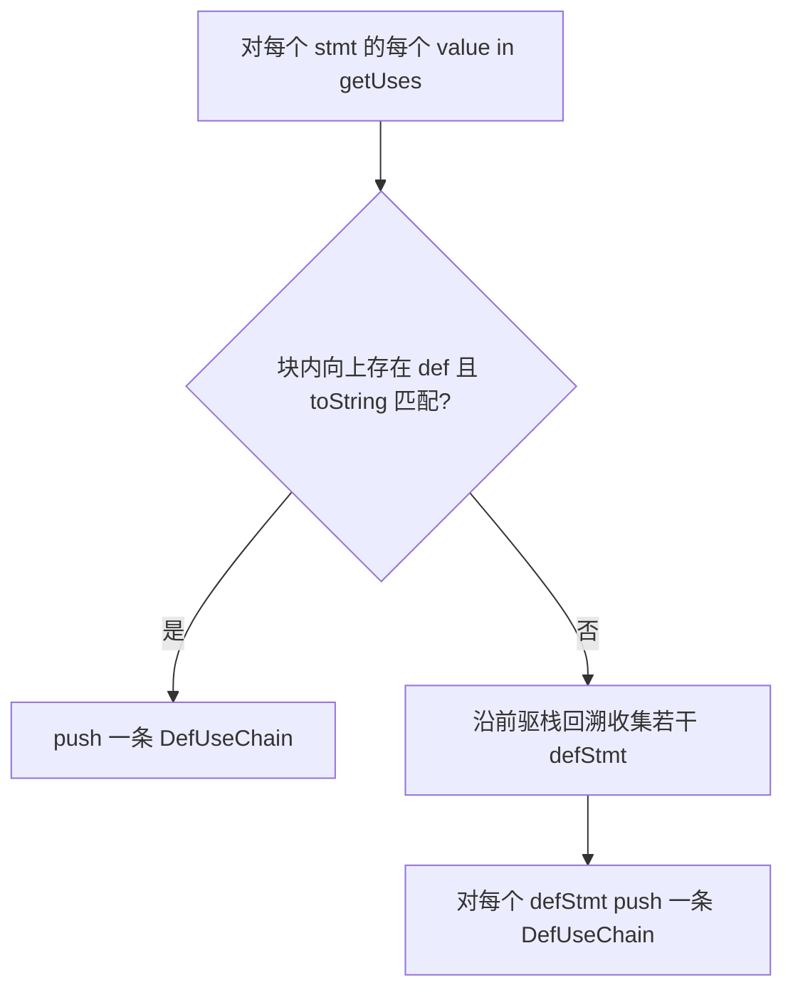

# 定义-使用链（Def-Use Chain）

本文说明 ArkAnalyzer 在 **CFG 上**如何为每条「使用」回溯「定义」，以及 **`DefUseChain`** 与 **`Local`** 上两套索引的差异与用法。

## 1. 概述

**定义-使用链（Def-Use Chain）** 描述：在某个 **use 语句** 处读取的某个 **Value**，其对应的 **def 语句** 是哪一条（或哪几条）。它是大量数据流分析与重构的基础：

- **反向**：从 use 找 def（未初始化、空值来源等）。
- **前向**：从 def 枚举所有 use（常量传播、taint、死赋值检测等）。
- **变换**：重命名 / 替换时以「def–use 边」为最小影响面。

实现上，每条链是 [`DefUseChain`](../../src/core/base/DefUseChain.ts) 三元组 `(value, def, use)`，缓存在 **`Cfg.defUseChains`** 中；**仅在**调用 [`Cfg.buildDefUseChain`](../../src/core/graph/Cfg.ts) 时按方法 **惰性** 构建。

> **前置条件**：建议先完成 **`scene.inferTypes()`**，再调用 `buildDefUseChain()`，以便 `Local` / `Ref` 等与类型相关的表示稳定（参见 [TypeInference.md](./TypeInference.md)）。

### 1.1 与其它文档的关系

| 主题 | 文档 |
|------|------|
| CFG 与基本块 | [CFG.md](../components/CFG.md) |
| `Stmt.getDef` / `getUses` | [Stmt.md §3](../components/Stmt.md#3-stmt-和各-ir-基础元素的关系) |
| 过程间数据流（常基于 def-use 思想扩展） | [IFDS.md](./IFDS.md) |
| 调用图精化 | [CallGraph.md](./CallGraph.md) |

## 2. 文档导航

| 章节 | 内容 |
|------|------|
| [§3 核心 API](#3-核心-api-与两套索引) | `DefUseChain`、`Cfg` 入口、`buildDefUseStmt` 与 `buildDefUseChain` 分工 |
| [§4 构建算法](#4-构建算法) | 控制流上回溯规则、`toString()` 匹配、流程图 |
| [§5 示例](#5-示例) | 分支汇合、循环回边 |
| [§6 与 SSA / Local](#6-与-ssa--local-索引的关系) | 非 SSA、多 def、`getDeclaringStmt` / `getUsedStmts` |
| [§7 限制与常见坑](#7-限制与常见坑) | 重复构建、匹配粒度、无 def 等 |
| [§8 典型应用场景](#8-典型应用场景) | 未初始化、taint、死代码、与 CallGraph 协同等 |
| [§9 使用示例](#9-使用示例) | 遍历 Scene、Local 视角、按 use 查 def |
| [§10 参考与测试](#10-参考与测试) | 源码路径、样例与单测 |

## 3. 核心 API 与两套索引

### 3.1 `DefUseChain`

```typescript
// src/core/base/DefUseChain.ts
export class DefUseChain {
    value: Value; // 在本次 use 处被读的 Value（多为 Local）
    def: Stmt;     // 回溯到的定义语句
    use: Stmt;     // 出现该 use 的语句
}
```

仅三个可写字段，无方法；语义完全由 `Cfg` 的构建逻辑约定。

### 3.2 `Cfg` 上与 def-use 相关的方法

| 方法 | 作用 |
|------|------|
| [`buildDefUseStmt(locals, globals?)`](../../src/core/graph/Cfg.ts) | 在 **构图 / 填体** 阶段调用：扫描 CFG 上所有 `Stmt`，为 **`Local`** 维护 **`declaringStmt`**（首次 def）与 **`usedStmts`**（所有出现该 Local 的 use 语句）。可传入 `globals` 避免把全局符号误记为当前方法的 Local def。 |
| [`buildDefUseChain()`](../../src/core/graph/Cfg.ts) | **惰性** 构建 `defUseChains`：对每个 `stmt` 的 `getUses()` 中每个 `value`，沿控制流回溯 def，并 **push** 多条 `DefUseChain`。 |
| [`getDefUseChains()`](../../src/core/graph/Cfg.ts) | 返回已构建的链数组（同一 `Cfg` 上多次调用 `buildDefUseChain` 会 **追加**，见 [§7](#7-限制与常见坑)）。 |
| [`getStmts()`](../../src/core/graph/Cfg.ts) | 按块收集所有语句（块顺序不保证与执行序一致；仅作遍历便利）。 |
| [`getUnreachableBlocks()`](../../src/core/graph/Cfg.ts) | 基于从入口块 DFS 后序可达性，返回不可达基本块集合；可与未初始化分析等结合过滤死代码。 |

### 3.3 `buildDefUseStmt` 与 `buildDefUseChain` 如何配合

```text
IR 落地、生成 ArkBody / Cfg
    → Cfg.buildDefUseStmt(...)     // 填 Local.declaringStmt + Local.usedStmts
    → （分析需要时）
    → Cfg.buildDefUseChain()       // 填 Cfg.defUseChains（带 def 与 use 的显式边）
```

- **`usedStmts`**：回答「这个 Local 在哪些 Stmt 里出现过」（**不含**每条出现对应哪条 def）。
- **`defUseChains`**：回答「在这条 **use Stmt** 里读的 **这个 value**，对应哪条 **def Stmt**」（多前驱时可有 **多条** 链指向同一 use）。

二者互补；很多客户端只需其一即可，复杂分析常两者兼用。

### 3.4 `Stmt` 侧钩子

| 方法 | 说明 |
|------|------|
| `Stmt.getDef(): Value \| null` | 三地址码中仅 **`ArkAssignStmt`** 重写为返回赋值左侧；其余 Stmt 子类为 **`null`**（见 [Stmt §3](../components/Stmt.md#3-stmt-和各-ir-基础元素的关系)）。 |
| `Stmt.getUses(): Value[]` | 该 Stmt 内所有被「读」的 `Value`，含子表达式展开。 |

回溯算法通过 **`value.toString()`** 与 **`beforeStmt.getDef()?.toString()`** 是否相等判定「同一符号」，因此依赖 IR 上 **名字的稳定性**（与类型推导、临时变量命名等相关）。

## 4. 构建算法

外层结构（[`Cfg.buildDefUseChain`](../../src/core/graph/Cfg.ts)）：

```text
for each basic block in cfg.blocks:
  for each stmt in block (升序下标):
    for each value in stmt.getUses():
      handleDefUseForValue(value, block, stmt, stmtIndex)
```

`handleDefUseForValue` 逻辑概要：

1. **块内向上扫**：从当前 `stmtIndex - 1` 递减到 `0`，找第一条满足 `beforeStmt.getDef()?.toString() === value.toString()` 的语句；若找到，**推一条链并返回**。
2. **前驱栈展开**：否则把当前块的所有 **前驱** 压入 `needWalkBlocks`，循环 **`pop()`** 一个前驱块，在其语句序列上 **自尾向头** 扫描；若该前驱块内命中 def，则记录到 `defStmts`；若未命中，则将该前驱的前驱 **`unshift`** 进队列（实现为 **栈 + 前向扩展**，**不是**严格 BFS）。
3. **多 def**：`defStmts` 中可能有多条语句（来自不同前驱路径）；最后对 **每个** `def` 各 `push` 一条 `DefUseChain(value, def, use)`。



## 5. 示例

### 5.1 分支：同一 use 对应多条 def

```typescript
function f(c: boolean) {
    let x: number;
    if (c) { x = 1; } else { x = 2; }
    return x;
}
```

简化 IR 下，`return x` 对 `x` 的一次 use 可能得到两条链（两侧 def 各贡献一条），**不**引入显式 `φ` 节点：

```text
{ value: x, def: x = 1, use: return x }
{ value: x, def: x = 2, use: return x }
```

下游分析必须把 **「(value, use) → 唯一 def」** 的假设改为 **「可能多 def」**。

### 5.2 循环：def 与 use 同句、回边与出口

```typescript
function f(): number {
    let s = 0, i = 0;
    while (i < 10) { s = s + i; i = i + 1; }
    return s;
}
```

`s = s + i` 同时是 `s` 的 def 与 use；链集合中可出现指向 **初始化 def**、**回边上一次 def** 以及 **return 处 use** 等多种组合，具体形态以当前 CFG 划分为准。

## 6. 与 SSA / Local 索引的关系

- ArkAnalyzer **不显式建 SSA**；多次赋值的 `Local` 通过 **多条** `DefUseChain` 表达汇合语义。
- **`Local.getDeclaringStmt()`**：由 `buildDefUseStmt` 写入，表示扫描 CFG 时遇到的 **第一次** 作为赋值左侧出现的语句；**不等于**「语义上唯一的 def」（循环、分支下常不成立）。
- **`Local.getUsedStmts()`**：所有出现该 Local 的 use 语句列表；**不携带**「该次 use 对应哪条 def」——若需要，请查 **`getDefUseChains()`** 并按 `use` / `value` 过滤。

## 7. 限制与常见坑

1. **重复调用 `buildDefUseChain()`**：实现 **不会清空** `defUseChains`，多次调用会在 **同一数组末尾追加**，易重复计数。若需重建，应在业务侧克隆 CFG、或自行约定只在每方法上调用一次。
2. **匹配键为 `toString()`**：跨类 `Value` 若字符串化不稳定，可能出现漏连或误连；与 IR 打印格式强相关。
3. **无前驱 def**：若回溯结束仍无 def，则 **不会** 为该 `(value, use)` 生成链——区别于「显式记录 ⊥/undefined def」的 SSA 形式。
4. **`getStmts()` 顺序**：按块聚合语句，**不等于**全局线性序；若需要块内序请走 `BasicBlock.getStmts()`。

## 8. 典型应用场景

### 8.1 未初始化变量检测

沿链反向：若某 use 在可达前驱上找不到任何 def，则可能在 use 处未初始化；结合 **`getUnreachableBlocks()`** 可弱化死块内的误报。

### 8.2 Taint / 常量传播

以 def 为源、沿链向 use 传播标记或常量；亦可作为 [IFDS](./IFDS.md) 实现的直觉模型。

### 8.3 死代码与无用赋值

若某 `ArkAssignStmt` 左侧 `Local` 在 **任何** 链中都不曾作为 `def` 被后续 use 依赖（需结合具体判定），可能提示可删除；**字段写、数组写等副作用**须单独排除。

### 8.4 与 CallGraph 协同

实参 use 沿链回到 def 后，可用类型或字面量收窄虚调目标，常见为在 [RTA](./CallGraph.md#22-rapid-type-analysisrta) 结果之上做增强。

### 8.5 重命名与替换

对某一 `Value` 收集所有链，对每条链在 `use` 上调用 **`Stmt.replaceUse(old, new)`**；改 def 侧则用 **`replaceDef`**。

## 9. 使用示例

### 9.1 标准用法（遍历 Scene）

```typescript
import { Scene, SceneConfig, DEFAULT_ARK_METHOD_NAME } from 'arkanalyzer';

const config = new SceneConfig();
config.buildFromProjectDir('tests/resources/defUseChain');
const scene = new Scene();
scene.buildSceneFromProjectDir(config);
scene.inferTypes();

for (const arkFile of scene.getFiles()) {
    for (const arkClass of arkFile.getClasses()) {
        for (const arkMethod of arkClass.getMethods()) {
            if (arkMethod.getName() === DEFAULT_ARK_METHOD_NAME) continue;
            const cfg = arkMethod.getBody()?.getCfg();
            if (!cfg) continue;

            cfg.buildDefUseChain();
            for (const ch of cfg.getDefUseChains()) {
                console.log(`value: ${ch.value}, def: ${ch.def}, use: ${ch.use}`);
            }
        }
    }
}
```

### 9.2 Local 视角（`usedStmts`）

```typescript
import { Local } from 'arkanalyzer';

const first = scene.getMethods().find(m => m.getBody()?.getCfg());
const cfg = first?.getBody()?.getCfg();
if (!cfg) {
    throw new Error('no method with CFG');
}
for (const stmt of cfg.getStmts()) {
    const def = stmt.getDef();
    if (def instanceof Local) {
        const uses = def.getUsedStmts();
        console.log(`def ${def.getName()} @ ${stmt} -> ${uses.length} uses`);
    }
}
```

### 9.3 从某条 use 语句反查所有 def

```typescript
import type { Cfg, Stmt } from 'arkanalyzer';

function findDefsForUseStmt(cfg: Cfg, useStmt: Stmt): Stmt[] {
    cfg.buildDefUseChain();
    return cfg.getDefUseChains().filter(c => c.use === useStmt).map(c => c.def);
}
```

> 可运行样例脚本：[tests/samples/DefUseChainTest.ts](../../tests/samples/DefUseChainTest.ts)。  
> `DefUseChain` 数据结构单测：[tests/unit/core/base/DefUseChain.test.ts](../../tests/unit/core/base/DefUseChain.test.ts)。

## 10. 参考与测试

| 资源 | 路径 |
|------|------|
| 三元组定义 | [`src/core/base/DefUseChain.ts`](../../src/core/base/DefUseChain.ts) |
| 构建逻辑 | [`src/core/graph/Cfg.ts`](../../src/core/graph/Cfg.ts)（`buildDefUseStmt`、`handleDefUseForValue`、`buildDefUseChain`） |
| `Local` 索引 | [`src/core/base/Local.ts`](../../src/core/base/Local.ts) |
| 小型工程（文档示例路径） | [`tests/resources/defUseChain/`](../../tests/resources/defUseChain/) |
