# ArkAnalyzer-cpp使用指导

## 一、arkCppAstDumper工具生成与使用
* 简介：解析C/C++源码文件生成抽象语法树

### 1、构建环境（根据构建要求选择）
* **LLVM**：使用19.1.7版本，llvm中clang-c目录下的13个头文件为arkCppAstDumper工具提供解析处理抽象语法节点的方法，libclang动态链接库为arkCppAstDumper工具提供编译器接口，下载地址：https://github.com/llvm/llvm-project/releases

* **Visual Studio 2022**：使用2022版本，通过Visual Studio下载windows平台的MSVC标准库头文件，也作为构建系统在windows平台构建arkCppAstDumper工具，下载地址：https://visualstudio.microsoft.com/zh-hans/downloads

* **llvm-mingw**：用于在linux上交叉编译构建windows版本的arkCppAstDumper工具，下载地址：https://github.com/mstorsjo/llvm-mingw/releases

* **osxcross**：用于在linux上交叉编译构建mac版本的arkCppAstDumper工具,下载地址：https://github.com/tpoechtrager/osxcross

* **macosx-sdks**：用于在linux上交叉编译构建mac版本的arkCppAstDumper工具,下载地址：https://github.com/joseluisq/macosX-sdks

* **cmake**：使用3.22.5及以上版本，构建命令构建arkCppAstDumper工具，下载地址：https://cmake.org/download

* **json.hpp**：用于将抽象语法树以json的格式输出，下载地址：https://github.com/nlohmann/json/blob/develop/single_include/nlohmann/json.hpp

### 2、构建arkCppAstDumper工具
#### 2.1、构建windows版本的arkCppAstDumper

##### 2.1.1、在windows平台构建arkCppAstDumper

根据windows平台下载对应的llvm预编译版本并解压

配置llvm的bin目录到环境变量

下载Visual Studio 2022安装包进行安装，打开Visual Studio install选择C++的桌面开发进行安装环境

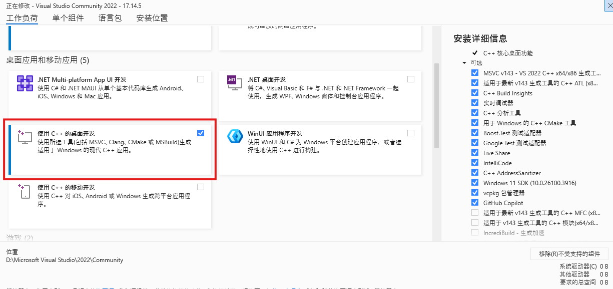

下载arkAnalyzer-cpp代码，将json.hpp文件放在arkanalyzer\src\cpp_frontend\ast\utils的目录下，在arkanalyzer\src\cpp_frontend\ast\cmake\toolchains\windows.cmake文件中配置llvm的clang-c和libclang.dll的路径

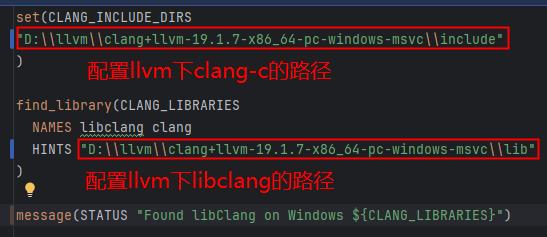

在arkanalyzer\src\cpp_frontend\ast的目录下执行以下命令，在arkanalyzer\src\cpp_frontend\ast\build\Release目录下生成工具

    mkdir build && cd build
    cmake -DCMAKE_TOOLCHAIN_FILE=..\cmake\toolchains\windows.cmake ..
    cmake --build . --config Release

执行依赖的文件：
* libclang.dll（可从llvm预编译版本的bin目录下获取）

##### 2.1.2、在linux平台交叉编译构建windows版本的arkCppAstDumper

下载windows版本的llvm预编译版本并解压

根据LLVM版本下载对应的llvm-mingw包并解压

下载arkAnalyzer-cpp代码，将json.hpp文件放在arkanalyzer\src\cpp_frontend\ast\utils的目录下，在arkanalyzer\src\cpp_frontend\ast\cmake\toolchains\mingw.cmake文件中配置llvm的clang-c和libclang.dll的路径,配置llvm-mingw的clang编译器和链接库

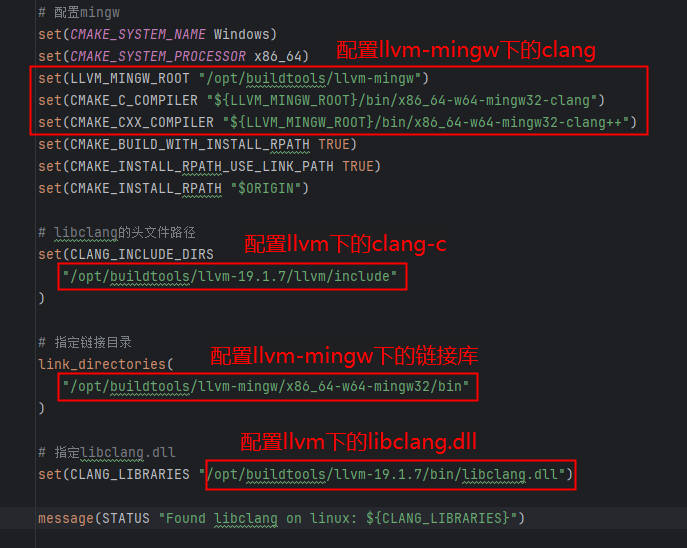

在arkanalyzer\src\cpp_frontend\ast的目录下执行以下命令，在arkanalyzer\src\cpp_frontend\ast\build目录下生成工具

    mkdir build && cd build
    cmake -DCMAKE_TOOLCHAIN_FILE=..\cmake\toolchains\mingw.cmake ..
    make

执行依赖的文件：
* libclang.dll（可从llvm预编译版本的bin目录下获取）
* libc++.dll（可从llvm-mingw的x86_64-w64-mingw32/bin目录下获取）
* libunwind.dll（可从llvm-mingw的x86_64-w64-mingw32/bin目录下获取）

#### 2.2、构建linux版本的arkCppAstDumper（x86和arm同理）
下载linux版本的llvm预编译版本并解压

下载arkAnalyzer-cpp代码，将json.hpp文件放在arkanalyzer\src\cpp_frontend\ast\utils的目录下，在arkanalyzer\src\cpp_frontend\ast\cmake\toolchains\linux.cmake文件中配置llvm的clang-c和libclang.so的路径

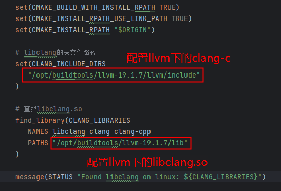

在arkanalyzer\src\cpp_frontend\ast的目录下执行以下命令，在arkanalyzer\src\cpp_frontend\ast\build目录下生成工具

    mkdir build && cd build
    cmake -DCMAKE_TOOLCHAIN_FILE=..\cmake\toolchains\linux.cmake ..
    make

执行依赖的文件：
libclang.so（可从llvm预编译版本的lib目录下获取）

#### 2.3、构建mac版本的arkCppAstDumper（x86和arm同理）
##### 2.3.1、在linux平台交叉编译构建mac版本的arkCppAstDumper
下载mac版本的llvm预编译版本并解压

下载osxcross源码，执行下列命令安装基础依赖环境

    apt install cmake clang git patch libssl-dev libxml2-dev xz-utils bzip2 cpio zliblg-dev

下载mac的SDK包放在osxcross/tarball目录下

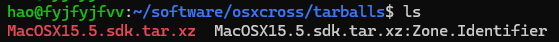

执行下列命令配置osxcross环境变量

    export OSXCROSS_INSTALL_DIR=osxcross根目录

在osxcross根目录执行构建脚本

    TARGET_DIR=${OSXCROSS_INSTALL_DIR} SDK_VERSION=sdk版本号 OSX_VERSION_MIN=14.0 ./build.sh

执行下列命令配置环境变量

    export OSXCROSS_TARGET_DIR=osxcross/target
    export LLVM_MACOS_ARM64_PATH=llvm的目录
    export PATH=${OSXCROSS_TARGET_DIR}/bin:$PATH
    export OSXCROSS_TARGET=darwin24.5
    export OSXCROSS_SDK=MacOSX15.5.sdk
    export OSXCROSS_HOST=arm64-apple-darwin24.5

下载arkAnalyzer-cpp代码，将json.hpp文件放在arkanalyzer\src\cpp_frontend\ast\utils的目录下，在arkanalyzer\src\cpp_frontend\ast的目录下执行以下命令，在arkanalyzer\src\cpp_frontend\ast\build目录下生成工具

    mkdir build && cd build
    cmake -DCMAKE_TOOLCHAIN_FILE=${OSXCROSS_INSTALL_DIR}/toolchain.cmake -DCLANG_INCLUDE_DIRS=${LLVM_MACOS_ARM64_PATH}/include -DCLANG_LIBRARIES=${LLVM_MACOS_ARM64_PATH}/lib/libclang.dylib ..
    make

执行依赖的文件：
* libclang.dylib（可从llvm预编译版本的lib目录下获取）

### 3、使用arkCppAstDumper工具

#### 3.1、arkCppAstDumper工具使用示例

##### 对单个文件生成抽象语法树并输出到文件.cpp同级路径下（默认路径）

    ./arkCppAstDumper.exe <文件.cpp>

##### 对单个文件生成抽象语法树并输出到指定路径

    ./arkCppAstDumper.exe <文件.cpp> -o <json文件指定路径>

##### 对单个文件生成抽象语法树并提供编译数据库文件

    ./arkCppAstDumper.exe <文件.cpp> -o <json文件指定路径> -c <编译数据库文件路径>

##### 对单个文件生成抽象语法树并提供多个-I编译参数

    ./arkCppAstDumper.exe <文件.cpp> -o <json文件指定路径> -i <头文件路径> -i <头文件路径> ...

##### 对单个文件生成抽象语法树并指定 TU Flags

    ./arkCppAstDumper.exe <文件.cpp> -o <json文件指定路径> -f <flags>

    其中 -f 参数用于控制 libClang 的 TranslationUnit 解析标志：
    默认总是包含 KeepGoing（保证 AST 构建在遇到错误时尽量继续）。
    允许与 DetailedPreprocessingRecord 组合，开启详细预处理记录（可以获取 #include 和 #define 等信息）。
    允许与 SingleFileParse 组合，仅解析单个源文件而不递归解析包含的头文件。
    多个标志可以用 , 或 | 分隔，例如：
    ./arkCppAstDumper.exe test.cpp -f "DPP|SingleFileParse"
    等价于 KeepGoing | DetailedPreprocessingRecord | SingleFileParse。

#### 3.2、arkCppAstDumper工具解析策略
- arkCppAstDumper会优先从-c获取编译数据库引入头文件的编译参数，如果编译数据库不存在再从-i获取引入头文件的编译参数，-c参数和-i参数不能同时存在，只能选其一。

## 二、使用ArkAnalyzer源码分析C++项目

1、将arkCppAstDumper工具及其依赖的文件放在arkanalyzer\src\cpp_frontend\ast\arkCppAst目录下

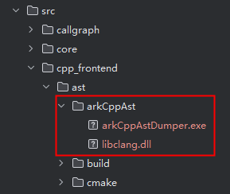

2、对需要分析的项目生成编译数据库，推荐的三种方式：

* 用DevEco Studio打开项目，点击file下的Sync and Refresh Project对项目自动生成编译数据库

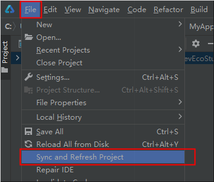

* 使用cmake原生支持生成编译数据库，在CMakeLists.txt文件添加下列设置

    set(CMAKE_EXPORT_COMPILE_COMMANDS ON)

* 安装bear拦截编译生成编译数据库
    
    sudo apt install bear
    bear -- cmake ..

3、设置SceneConfig，路径：arkanalyzer\src\Config.ts

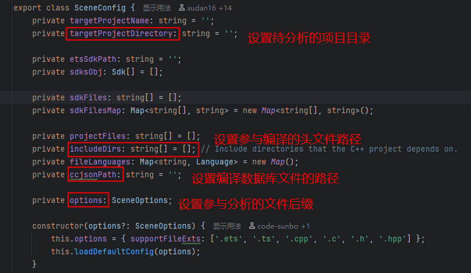

4、设置c++头文件到环境变量，当没有编译数据库时作为头文件搜索路径

* windows平台设置DevEco studio目录下c++头文件
  

* linux平台设置commomd-line-tools目录下的c++头文件
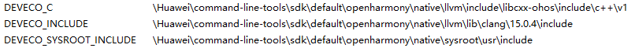

* mac平台设置DevEco studio和MacOSX.sdk目录下的c++头文件
* 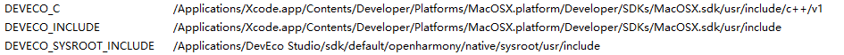

5、执行接口，SceneConfig作为参数传给buildSceneFromFiles方法生成Scene结构的ArkIR，路径：arkanalyzer\src\Scene.ts

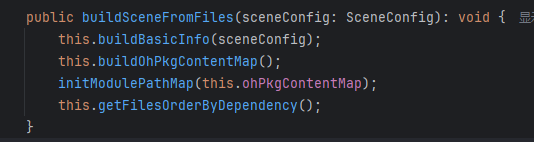

6、执行流程：

* 根据SceneConfig中项目目录编译所有的文件，通过配置中的文件后缀过滤掉其它不需要分析的文件。

* 遍历需要分析的文件分别执行arkCppAstDumper工具对单个文件生成抽象语法树。

* arkAnalyzer-cpp遍历抽象语法树对每个节点进行解析处理生成Scene结构的ArkIR。

## 三、基于ArkAnalyzer npm包分析C++项目

1、修改package.json文件中dumper工具的目录，删除postinstall配置，将dumper工具打包到包中

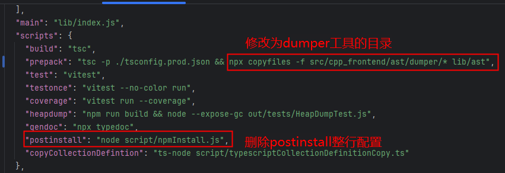

2、在arkanalyzer根目录下执行下列命令进行打包生成arkanalyzer-1.0.8.tgz包
   
    npm pack

3、将arkanalyzer-1.0.8.tgz包放在homecheck根目录下执行下列命令进行安装
 
    npm install arkanalyzer-1.0.8.tgz

4、在homecheck中引入arkanalyzer的SceneConfig和Scene，在SceneConfig配置项目信息，将SceneConfig配置传给Scene的buildSceneFromFiles方法生成Scene结构的ArkIR

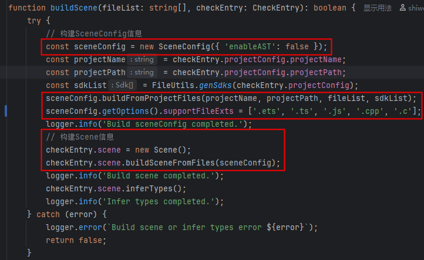

