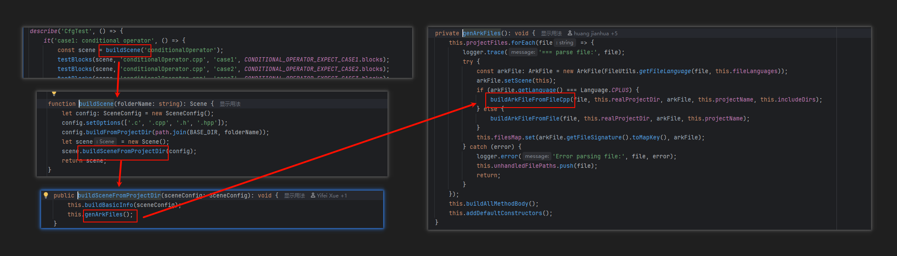
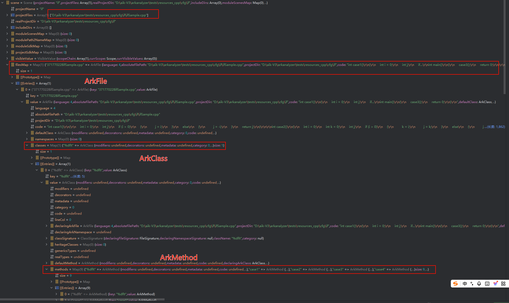
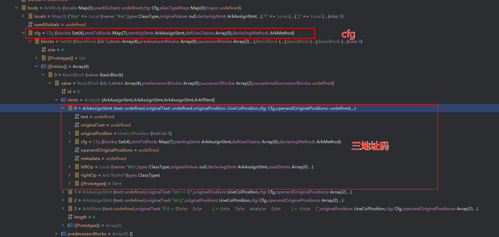
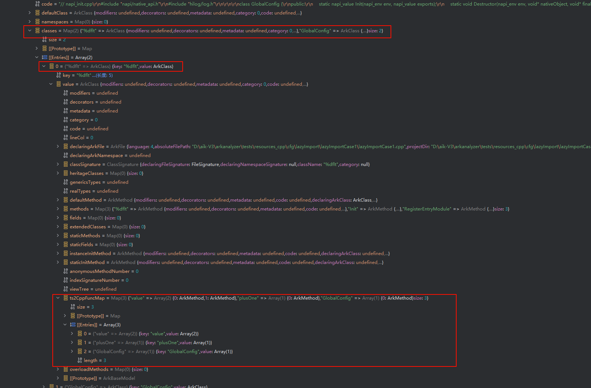
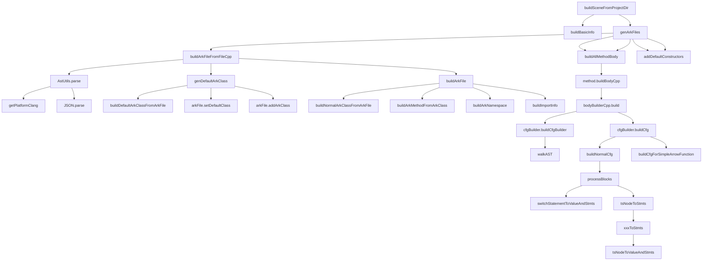

# ArkAnalyzer-CPP前端

## 一、ArkAnalyzer-CPP工具使用介绍
### 1、外部接口调用
在本分支下，对ArkAnalyzer使用者提供统一接口调用，可以参考tests/unit/core_cpp/graph/Cfg.test.ts测试文件中的构建
```
    let config: SceneConfig = new SceneConfig();
    config.buildFromProjectDir(path.join(BASE_DIR, folderName));
    let scene = new Scene();
    scene.buildSceneFromProjectDir(config);
    return scene;
```
只需要调用SceneConfig和scene构建即可，其中config.buildFromProjectDir()传入的参数是需要解析的项目路径。该函数位置在src/Scene.ts中
以一个if代码的解析做介绍，解析过程如下图所示:

在解析过程中，genArkFiles函数会区分文件类型，对于cpp文件会调用buildArkFileFromFileCpp生成对应语法树。
在genArkFiles下的buildAllMethodBody中调用method.freeBodyBuilderCpp()进行函数内语句的解析。
### 2、解析结果，scene展示
如下图所示



一般情况下，CPP语言解析得到的Scene结构和Ts语言所解析出的结构是相同的，这个scene屏蔽掉语言的差异，便于开发者做其他方向的使用。
如果一个cpp接口是在ts语言中被调用的接口，会在Scene结构中添加ts2CppFuncMap进行暴露，通过setTs2CppFuncMapOfClass函数进行填充。
这里以懒加载任务提供的代码示例


## 二、cpp_frontend模块介绍

#### 路径：ArkAnalyzer/src/cpp_frontend

### 1、common模块

 ArkIRTransformerCpp：继承ArkAnalyzer/src/core/common下的ArkIRTransformer，复用了ArkIRTransformer下的方法，根据c++语法重写和新增了ArkIRTransformerCpp下的方法

 ArkValueTransformerCPP：继承ArkAnalyzer/src/core/common下的ArkValueTransformer，复用了ArkValueTransformer下的方法，根据c++语法重写和新增了ArkValueTransformerCpp下的方法

 ModelUtils：根据c++语法编写了关于获取头文件的include信息的方法

TypeInference：根据c++语法编写了关于类型推断的方法，该文件下许多方法的函数体与ArkAnalyzer/src/core/common/TypeInference相同，因为c++和typescript使用的AST结构不同，所以不能复用

ValueUtilsCpp：继承ArkAnalyzer/src/core/common下的ValueUtils,复用了ValueUtils下的方法，根据c++语法新增了normalizeString和createStringConst两个方法

### 2、graph模块

CfgBuilder：根据c++语法编写了关于构建cfg的方法，复用了ArkAnalyzer/src/core/graph/builder/CfgBuilder下的BlockBuilder, Case, Catch, TextError, Variable, Scope对象

### 3、model模块

 ArkClassBuilder：根据c++语法编写了关于构建cfg结构下ArkClass的方法，复用了ArkAnalyzer/src/core/model/builder/ArkClassBuilder下的方法和对象

 ArkFieldBuilder：根据c++语法编写了关于构建cfg结构下ArkField的方法

 ArkFileBuilder：根据c++语法编写了关于构建cfg结构下ArkFile的方法，复用了ArkAnalyzer/src/core/model/builder下ArkExportBuilder和ArkClassBuilder的方法

 ArkImportBuilder：根据c++语法编写了关于构建cfg结构下ArkInclude的方法

 ArkMethodBuilder：根据c++语法编写了关于构建cfg结构下ArkMethod的方法，复用了ArkAnalyzer/src/core/model/builder下ViewTreeBuilder和ArkMethodBuilder的方法和对象

 ArkNamespaceBuilder：根据c++语法编写了关于构建cfg结构下ArkNamespace的方法，复用了ArkAnalyzer/src/core/model/builder/ArkNamespaceBuilder下的方法

 BodyBuilderCpp：根据c++语法编写了关于构建整个cfg结构的方法，从BodyBuilderCpp开始调用cpp_frontend模块下的方法，复用了ArkAnalyzer/src/core/model/builder/ArkMethodBuilder的方法

 builderUtils：根据c++语法编写了关于构建cfg的常规方法，复用了ArkAnalyzer/src/core/model/builder下ArkMethodBuilder和builderUtils的方法

## 三、ArkAnalyzer-CPP前端暴露接口，ArkAnalyzer/src/Scene下调用

 1、ArkAnalyzer/src/cpp_frontend/model/builder/ArkFileBuilder下的buildArkFileFromFile方法，该方法获取c++的抽象语法树

 2、ArkAnalyzer/src/cpp_frontend/model/builder/ArkMethodBuilder下的addInitInConstructor方法，该方法添加默认的构造函数

 3、ArkAnalyzer/src/cpp_frontend/model/ArkMethod下的buildBodyCpp和freeBodyBuilderCpp方法，作用分别是构建cfg和释放资源

## 四、ArkAnalyzer-CPP工具开发介绍
### 本部分介绍ArkAnalzyer解析Cpp源码生成IR的接口逻辑，主要是关键函数相关的调用逻辑，以及函数功能的介绍
#### 1、对scene数据结构的介绍，ArkAnalyzer项目的核心就是在将代码解析成scene数据结构

（scene的介绍）


### 2.下面介绍Cpp代码解析的过程
<核心函数调用图>

#### 项目入口
首先配置config结构，如
config.buildFromProjectDir(path);
将需要解析的项目源码位置存储到config结构中。
随后使用scene的buildSceneFromProjectDir进行scene构建。
scene.buildSceneFromProjectDir(config);
#### 下面是构建过程的详细介绍，整个过程分为两个阶段，第一阶段是生成Arkfile，ArkClass，和ArkMethod：①调用libClang工具生成ast语法树，②ArkAnalzyer对生成的语法树解析，构造scene结构。
第二阶段，对method的语句进行解析。
##### 第一阶段：
```
    private genArkFiles(): void {
        this.projectFiles.forEach(file => {
            logger.trace('=== parse file:', file);
            try {
                const arkFile: ArkFile = new ArkFile(FileUtils.getFileLanguage(file, this.fileLanguages));
                arkFile.setScene(this);
                if (arkFile.getLanguage() === Language.CPLUS) {
                    buildArkFileFromFileCpp(file, this.realProjectDir, arkFile, this.projectName, this.includeDirs);
                } else {
                    buildArkFileFromFile(file, this.realProjectDir, arkFile, this.projectName);
                }
                this.filesMap.set(arkFile.getFileSignature().toMapKey(), arkFile);
            } catch (error) {
                logger.error('Error parsing file:', file, error);
                this.unhandledFilePaths.push(file);
                return;
            }
        });
        this.buildAllMethodBody();
        this.addDefaultConstructors();
    }
```
如上述代码所示在genArkFiles()函数中，通过区分cpp和ts源码文件，选用不同的接口，这里调用buildArkFileFromFileCpp，这个过程称作一轮翻译，在代码上是粗粒度的划分，将文件按类划分，记录类中的方法，对于方法中的语句不做解析，留到后续的二轮翻译中做。这里的划分时，如果一个函数或语句不属于一个规定出的类，那么他就被划分到默认类中；如果一个类中有语句不属于某个函数，他就会划分到默认函数中；
在buildArkFileFromFileCpp函数中调用AstUtils.parse()函数生成并记录生成的语法树
AstUtils.parse()：在该函数中的核心代码是调用ast生成工具arkCppAstDumper.exe，该工具由精卫团队集成，可以生成语法树的json格式的文件。函数中会将生成的json格式文件解析存储到translationUnit中，存储后删除原json文件
语法树生成后，构建scene中的默认类genDefaultArkClass(),以及调用buildArkFile()构建其他类。
##### 第二阶段：
这一部分主要介绍两个处理过程：
1、buildAllMethodBody()，在此函数中使用buildBodyCpp()接口,在开发中walkAST依据语法树的结构划分出block，并构建出block的前后继关系
2、tsNodeToStmts：在这个函数中根据不同的模块类型，进行不同的处理，比如传入节点是IfStmt时，选择对应的ifStatementToStmtsCpp，构建出相应的IR表示，这里的IR就是三地址码的形式了，例如其中条件表达部分调用conditionToValueAndStmts，构造ArkConditionExpr

当前ArkAnalzyer在解析源码生成中间IR集